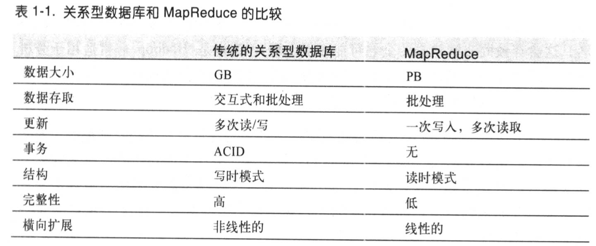
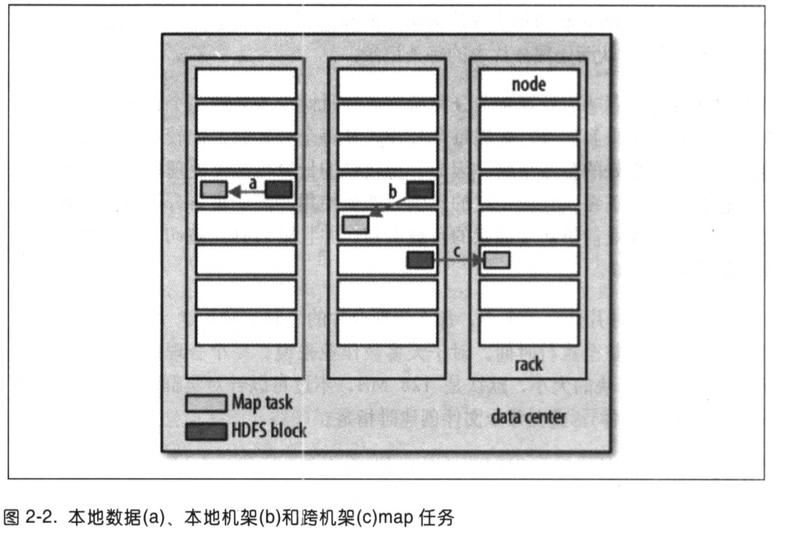
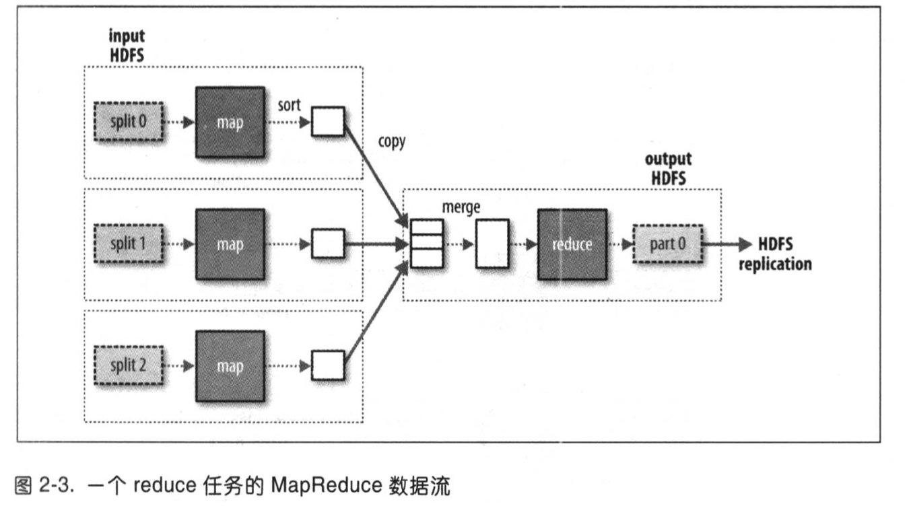
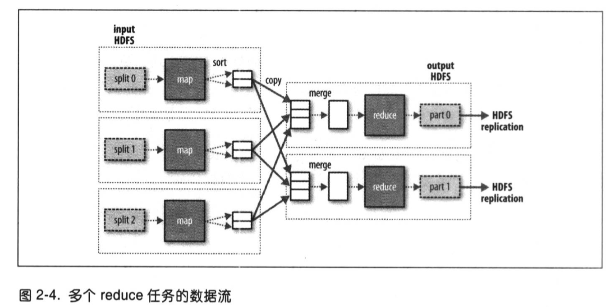
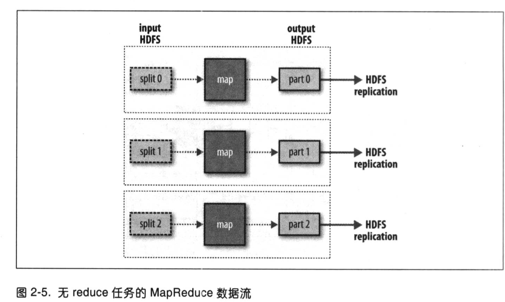

# hadoop权威指南

## 1. 初识hadoop

大数据面临的问题：数据量存储量越来越大，读取速度跟不上

解决方案：为了解决这个问题，可以在多个硬盘上各自存储少量数据，在需要时，多个硬盘同时读取，提升读取速度。

解决方案带来的附加问题：

1. 浪费：每个硬盘上存储少量数据又会造成存储空间的浪费，而共享存储空间+用户并不总是同时使用空间，可以解决浪费的问题。
2. 故障：个别硬件会出现故障，需要通过冗余数据副本来避免数据丢失。RAID冗余硬盘阵列和HDFS都是通过冗余来解决这个问题的。
3. 数据的结合使用：一个硬盘读取的数据可能需要和其他多个地方读取来的数据结合使用，需要保障数据的正确性，MapReduce的诞生解决了这个问题。

MapReduce：不适合交互式分析的批处理系统，更适合用户不在场的离现场景。

HBase：使用HDFS作为底层存储的键值存储模型，提供对单行/数据块的在线读写批操作。

YARN：一个集群资源管理系统，允许任何分布式程序（不仅是MapReduce）基于hadoop运行。

hadoop相较于其他系统的优势：

寻址速度（寻址是硬盘磁头移动到指定位置进行读写的过程）的提升远不敌传输速率的提升，访问模式中的寻址操作太多，必然花费更长的读取时间（流数据读取模式主要取决于传输速率），少量数据更新时，传统关系型数据（B树）更有优势，但大量数据更新，MapReduce强得多。

MapReduce应视为关系型数据库管理系统RDBMS的补充，MapReduce适合解决需要批处理方式分析整个数据集的问题，RDBMS适用于索引后数据集的点查询和更新。MapReduce适合一次写入、多次读取的应用，RDBMS适用于持续更新的数据集。

hadoop和RDBMS之间的界限很模糊，两者在互相借鉴靠拢，Hive（hadoop的一种）增加了索引和事务的特性， 更像RDBMS。

另一个区别在于他们所才做的数据集的结构化程度，RDBMS主要操作结构化数据，MapReduce操作半结构化和非结构化数据更强，因为它只在处理数据时才对数据进行解释（结构化），即是所谓的“读时模式”，避免了数据加载时解释产生的高开销。

RDBMS的规范性要求保持数据的完整性且不含冗余，MapReduce在处理不规范的大量数据中表现出高性能。

hadoop中的处理模型（MapReduce等）可随数据规模显示型伸缩，集群规模不变的情况下，如果输入的数据量是两倍，处理时间也是两倍，如果集群规模也扩大两倍，那么处理时间不变，SQL查询一般不具备这样的特性。

网格计算：

数据本地化是hadoop数据处理的核心，尽量在计算节点上存储数据，访问的数据量极大时，实现数据的本地快速访问，避免计算节点因为网络带宽的瓶颈问题而闲置。

高性能计算主要采用类似消息传递接口（MPI）的方式进行，虽然赋予了程序员极大的控制权，但需要其显性的控制，手动构造底层的功能模块和高层的数据分析算法，编程难度高。hadoop中，程序员金聪数据模型角度考虑任务的执行即可，无需关心底层的进程协调（如部分进程挂了的情况下如何保证整个计算继续完成），框架会自动检测失败机器并在有效机器上重新执行，因为MapReduce的无共享框架使得各个任务之间彼此独立，执行顺序无关紧要。

## 2. 关于MapReduce

一种模型，用于数据处理，可用各种语言编写，本质是并行的程序，优势在于处理大规模数据集。

难点：如何划分作业、如何协调各个机器处理作业、如何保证可靠性

map任务是提取和处理数据，reduce任务计算数据，输出结果；还需要一个总程序来合并结果。

集群上的可用带宽限制MapReduce作业的数量（作业越多、占用的传输带宽越多） 

#### 数据流

一个MapReduce作业（job）是一个执行工作单元，包括输入数据、MapReduce程序、配置信息；

hadoop将一个作业分为多个任务（task），包括map类任务和reduce类任务；

任务运行在集群节点上，通过YARN调度，失败的任务会在其他节点上重新调度运行。

输入数据会被划分为等长的数据块（分片，input split），每个分片构建一个map任务，该任务处理该分片中的每条数据。

分片与负载：多个分片使得数据整体输入时间减少；较小的分片在性能不同的计算机上可以得到更好的分配（能者多劳、能者快劳），从而提升效率，切片越小，负载平衡的越好，但是过多的分片会增加分片管理、map构建的时间，需要平衡两者。通常一个合理的分片大小趋于HDFS一个节点的大小（规避节点间数据传输），默认128MB，可以根据集群情况调整、或在文件创建时修改。

map任务在存储了输入数据的节点上运行，即数据本地化优化，这样可以节省数据传输带宽（无需节点间传输、机架间传输）。当存储了输入数据的节点已经运行了其他map任务，则从同机架上找没有运行map任务的map槽（slot），并不得不将数据复制传输到其他节点，运行map任务；极少数情况下发生机跨机架任务。

reduce任务没有“数据本地化”的概念，因为其输入来自多个mapp任务的输出，数据传输是免不了的。reduce任务的数量可以单独指定，当有多个reduce任务，map的输出也会进行分区，每个reduce任务对应一个分区，分区默认通过hash进行，也可自定义。reduce任务的数量可以有1、n、0三种，有n多个reduce任务时，reduce任务间的数据流称为shuffle混洗；当数据处理（map）可以完全并行（无需混洗）时，会出现无reduce任务的情况，map直接将结果写入HDFS。

combiner函数，是一种优化方案，map任务的输出可以指定给一个combiner函数，它位于map和reduce之间，用于进一步处理map函数的输出，减少数据传输造成的带宽消耗，combiner无法完全代替reduce。

## 3.hadoop分布式文件系统——HDFS

管理网络中跨多台计算机存储的文件系统成为分布式文件系统。HDFS是hadoop自带的分布式文件系统，是一个综合性的文件系统抽象

#### HDFS 设计特点

存储超大文件：几百MB、GB、TB甚至PB级数据

流式数据访问：一次写入、多次读取；读取整个数据集的时间延迟比读取第一条记录的延迟更重要，是主要的优化目标

商用硬件：hadoop集群运行在普通商用硬件构建的集群上，并不依赖昂贵可靠的硬件，商用硬件节点故障率较高，HDFS需要做到遇到部分节点故障时，继续运行，且用户察觉不到明显中断

数据访问的时延：HDFS为高数据吞吐量应用设计，代价是提高时间延迟，时延要去高的应用不合适（HBase可能更好用)

大量的小文件：文件的元数据存储在内存中，一般一个元数据（文件、目录、数据块的存储信息）大概150字节，100w个文件至少需要300MB的内存来存储元数据，数十亿的文件则超出当前硬件的能力

写入与修改文件：HDFS只支持单个写入者，写操作只允许“只添加”模式，在文件末尾追加写数据，不支持修改文件任意位置内容

#### HDFS 相关概念

##### 数据块

磁盘有自己的数据块，是磁盘读写数据的最小单位；文件系统管理磁盘数据块，文件系统块的大小是磁盘块的整数倍；HDFS系统中也有块，默认128MB，比磁盘块大得多（512字节），目的是为了减小寻址开销，HDFS的块中存储一个小于块大小的文件时，不会占据整个存储单元（单一磁盘文件系统中会）。

##### namenode和datanode
节点管理模式，namenode管理节点、datanode工作节点。namenode管理命名空间，维护文件系统树及书内文件和目录，永久保存在本地磁盘上，namenode记录着每个文件所在数据节点的信息，块的位置信息会在系统启动时根据数据节点信息重建，并不永久保存在namenode中。

用户使用客户端，通过namenode和datenode来交互访问文件系统，客户端提供了系统文件接口，用户不必知道namenode和datanode也可以编程。

datanode负责存储和检索数据块，受客户端或namenode调度，定期向namenode发送它存储的块的列表。

namenode损坏或丢失时，所有文件都会丢失，因为无法根据datenode重建文件，所以namenode的容错很重要。hadoop的一种容错机制是将namenode备份在多个文件系统上，本地磁盘写入时，实时同步写入远程挂载的网络文件系统NFS上；另一种办法是运行一个辅助namenode，定期合并编辑日志和命名空间镜像，防止编辑日志过大。它的同步是滞后主节点的，主节点全部挂掉的时候，会不可避免的丢失一点数据。当主节点挂掉，将NFS的namenode元数据复制到辅助namenode，成为新的主namenode运行。

##### 块缓存

datanode通常从磁盘中读取块，但频繁访问的文件，其块可以显式的缓存在datanode的内存中，通过在该datanode上运行任务，实现数据本地化，提高读操作性能。

##### 联邦HDFS

namenode在内存中保存文件系统中每个文件和数据块的引用关系，所以内存成为集群的扩展瓶颈，联邦HDFS允许通过添加namenode来进行扩展，namenode之间相互独立，不进行通信，一个失效也不会影响其他的，每个namenode维护单独的一部分命名空间卷。

##### HDFS的高可用性

namenode依旧存在单点失效的问题，会造成整个hadoop瘫痪

恢复服务需要一个namenode副本并配置datanode和客户端：命名空间的映像导入内存、重演编辑日志、接收到足够多的datanode数据块报告并退出安全模式。对于一个大型集群，上述过程冷启动可能需要30分钟甚至更久。

由于失效是无法完全避免的，提升在计划内的失效恢复时长很重要。Hadoop2配置了一对【活动-备用】namenode，活动namenode失效时，备用namenode接管它的任务，使得hadoop没有明显的中断。

### hadoop文件系统

hadoop有一个抽象文件系统概念，HDFS只是其中一个实现

## 4.集群资源管理系统——YARN

提供请求和使用集群资源的API，构建在HDFS和HBase上，pig、hive等构建在MapReduce、spark 或者 tez上

通过两类长期运行的守护进程提供服务：资源管理器（管理集群资源的使用）、节点管理器（运行在集群中所有节点上且能够启动和监控容器）。容器用于执行特定的应用程序的进程，每个容器都有资源限制。

YARN的运行机制：略

YARN的调度机制：略

## 5.hadoop的 I/O操作

## 14.关于Flume

flume用于向hadoop导入基于事件的海量数据。典型例子是利用flume从一组web服务器收集日志文件，然后将文件中的日志事件转移到一个新FDFS汇总文件中，用于进一步处理，其终点（sink）通常为HDFS。flume比较灵活，也可以把数据写到HBase或Solr系统中。

使用flume需要运行一个flume代理（一个java进程），包括source（数据来源）、sink（数据目标）和channel（链接source和sink）。source生产事件，传给channel，channel存储这些事件直至转发给sink，source-channel-sink是Flume的基本构件。

##### 事务与可靠性

flume使用两个独立的事件分别负责从source到channel和从channel到sink。source传递到channel且提交成功，source将标记该文件传输完成。channel到sink类似，当传递失败，事务回滚，等待重新传递。file channel类型的channel具有持久性，重启代理事件也不会丢失，memory channel在缓存中，重启就会丢失，memory channel可以提供更高的吞吐量，根据具体应用决定采取哪种方式。

source的每个事件都一定会到达sink至少一次，会有部分情况导致重复，后续数据处理流程去掉即可。在保证可靠性的前提下，这样处理的成本比采用exactly-once所需要的两阶段提交协议成本更低。

flume以事务为单位批处理事件，提高性能，每个事务只写一次本地磁盘和调用一次fsync

##### HDFS Sink

## 17.关于Hive

一个构建在hadoop上的数据仓库框架。hive的主要目的是能够使用SQL在海量HDFS文件中进行大规模的数据集查询。hive将SQL查询转换为一系列在hadoop集群上运行的作业。hive 把数据组织为表，给HDFS上的数据赋予结构，元数据存储在metastore数据库中。hive能够在原始数据上执行sql查询，是其亮点所在。

hiveQL是SQL的一种，和MySQL语法相近。HiveQL大小写不敏感。

### 17.4 与传统数仓比较

##### 17.4.1 读时模式 vs 写时模式

传统数据库里，表的模式在数据加载时强制确定，加载时发现数据不符合模式，则拒绝加载，数据是在加载（写入数据库）时进行的检查，所以称为“写时模式”；hive在执行查询时才验证数据，称为“读时模式”。

用户可以再两种方法间进行权衡。读时模式使数据加载非常快，因为无需解析数据、序列化并以数据库内部各式存入磁盘，仅仅是文件的复制或移动。写时模式能提升查询性能，数据库可以对列进行索引、压缩，代价是加载数据更久，且查询方式未确定的情况下，无法决定使用哪种索引。

##### 17.4.2 更新、事务和索引

hive被设计为用MapReduce操作HDFS数据，表的更新时通过变换数据后放入新的表中实现的。

在开启事务时，表的插入、更新、删除等操作会保存在增量文件中，定期由metastore运行的MapReduce作业将增量表合并到基表文件中。

hive引入了表级和分区级的锁，由zookeeper透明管理，防止一个进程删除正在被另一个进程读取的表。

hive的索引分为紧凑索引和位图索引，hive的索引实现设计为可插拔的，也可以设计出其他类型的索引。

### 17.5 SQL与HiveQL

### 17.6 表

hive的表逻辑上由存储的数据、描述表中数据形式的相关元数据组成，数据存放在HDFS或其他hadoop文件系统中，元数据存放在关系型数据库中。

#### 托管表和外部表

托管表是由hive来管理数据，数据会被移入hive的仓库目录（warehouse）中，删除（drop）的托管表，会将元数据和数据一起都删除掉，数据会彻底消失。

外部表，需要声明一个hive数仓目录以外的位置，让hive去访问，hive不会将数据移入仓库，此时hive甚至不会检查数据是否存在，这个特性使得用户可以在建表之后再去创建数据。删除外部表时，hive只会删除元数据，而不会动数据。

两种表在使用上没有很大差别，通常当所有处理都有hive完成时，应使用托管表，如果是hive和其他工具共同处理一个数据集，或想用一个数据集关联不同的模式时，应使用外部表。

#### 分区和桶

分区和桶都是用于提高查询速度的结构，层次不同。

分区是在创建表的时候，指定某些列作为分区条件。将数据加载到某分区时，需要显式地指定分区的值。SHOW PARTITIONS tablename 用于查询某个表的 分区/子分区 情况。用 PARTITION BY 指定的分区列，是表中正式的列，但是数据文件中并没有分区列数据，分区数据是在创建表的时候添加的，并非原数据的一部分，它表现为一个目录名。

分桶能提高连接效率，略

分桶还可以用于高效的随机取样，略

#### 存储格式

hive使用行格式和文件格式两种维度进行存储管理。SerDe（序列化和反序列化工具）用来在两种格式间切换，当查询表时，SerDe将文件中的数据反序列化为hive操作数据的对象形式，执行INSERT或CTAS时，SerDe将hive的数据行序列化形成字节形式，输出到文件中。

#### 导入数据

使用INSERT语句，把数据从一个hive表填充到另一个，或者新建表的时候使用CTAS（CREATE TABLE ... AS SELECT ) 。

#### 表的修改

hive的读时模式使得在创建表之后可以非常灵活的支持对表的修改，但是要确保修改数据来复合新的表结构。

####  表的丢弃

DROP TABLE，托管表删除表数据和元数据，外部表只删除元数据。

TRUNCATE TABLE，删除表内数据，但保留表定义。该方法对外部表不起作用。

### 17.7 查询数据

略

#### 17.7.5 视图
视图是通过SELECT 语句生成的虚表，只在引用视图时才执行查询。如果虚表的计算量很大，最好还是建一个新表。

视图可以用来限制用户，只有被授权的才能看到表的子集。

使用CREATE TABLE...AS SELECT  语句来将视图物化。

视图是只读的，无法通过视图对基表进行加载或插入数据。

### 17.8 用户定义函数UDF*
UDF是用户自己编写的脚本，可以使数据流经用户自己编写的函数，用于实现特定的处理。hive是java写的，所以UDF也必须用java写。

UDF有三种：普通UDF、用户定义聚集函数UDFA、用户定义表生成函数UDTF
- 普通UDF：操作单个数据行，输入输出都是单个数据，大多数数学函数和字符串函数都是这种类型
- UDAF：接收多个数据行数据，输出一个输出数据行，如COUNT和MAX函数
- UDTF：操作单个数据行，输出多个数据行

## 19. 关于spark
一种大数据集群计算框架，不使用MapReduce。

spark能将作业与作业之间产生的大规模工作数据集存储在内存中，而MapReduce的的数据集始终需要从磁盘上加载，使得spark性能超过了等效的MapReduce工作流，通常高出一个数量级。

## 20. 关于HBase

### 20.1 HBase 基础

在HDFS上开发的面向列的分布式数据库，适用于实时随记访问超大规模数据集的情况。

数据库的存储和检索的实现，绝大多数办法不是为大规模可伸缩的分布式处理设计的，HBase自底向上构建，通过简单增加节点来达到线性扩展。能够实现在廉价硬件构成的集群上管理超大规模的稀疏表。

HBase不是关系型数据库，不支持SQL。

### 20.2 概念
1. 表：表由行列组成。
2. 单元格：单元格由行列坐标交叉决定，单元格由版本，默认情况下自动分配，为HBase插入单元格时的时间戳。单元格的内容是未解释的字节数组。
3. 行：行有自己的键，也是主键，理论上任何东西动能表示成字符串或将二进制转为长整型或直接序列化数据结构，来作为键值，所有对表的访问都必须通过表的主键。
4. 列：列被分为列族，列族下可以有多个成员，表示方法为—— 列族名:成员名，如 info:format，即info列族下的format成员，用来存储文件元数据的格式信息。表模式定义时，必须给出列族，而列族成员可以随时更新加入。因为HBase实际上是一个面向列族的存储器，所以通常列族内的成员应该有相似的访问模式和大小特征。
5. 区域：相当于分区，由HBase自动划分，一个区域由表中行的子集构成。区域由所属的表、包含的第一行、包含的最后一行，来表示。刚开始一个表只有一个区域，当数据量超过设定的阈值，HBase自动划分出新的区域。区域是HBase集群上分布数据的最小单位。当数据太大时，该表就会被分为区域放到集群中。所有区域按顺序排列即构成了表。
6. 加锁：对行的更新是原子的，使得加锁模型保持简单。

### 20.6 HBase 和 RDBMS 的比较
