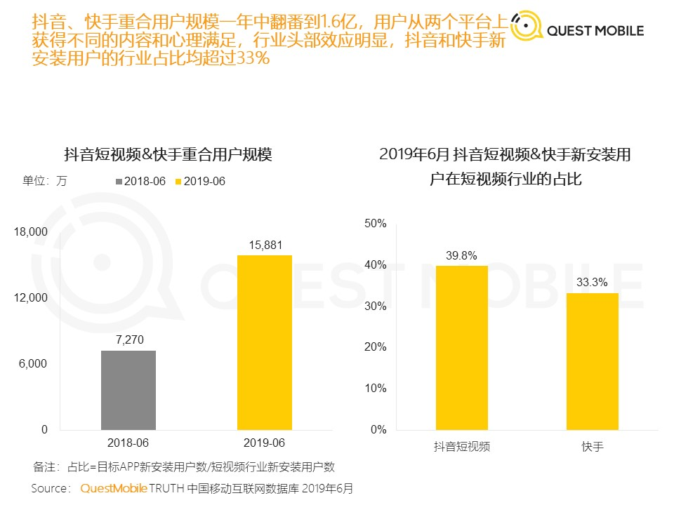
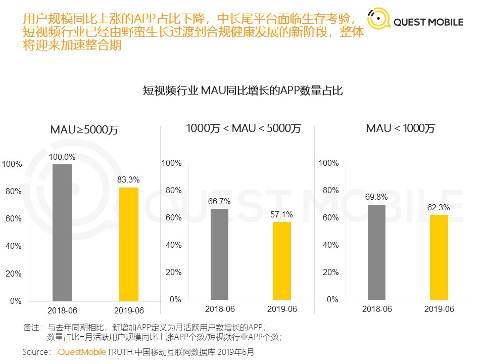

---

---

# 行业报告观察

## 移动短视频

### QuestMobile 短视频2019半年报告-201906

[原文链接]:https://www.questmobile.com.cn/research/report-new/58

#### 摘要

#### 1. 用户规模

短视频行业6月份，新安装用户接近1亿，MAU 8.21亿，占互联网用户总量72%，同比增速32%，在线视频总体 MAU 9.64亿，同比增速2.4%，二者差距正在持续缩小。

新增用户主要来自35岁以上、三四线城市下沉用户

#### 2. 行业竞争

人均打开短视频类APP 1.75个，同比增11%，行业竞争加剧，窗口收窄，流量争夺，用户独占率普遍下降。抖音快手重合用户规模翻翻达到1.6亿

玩家布局全景生态找流量，APP+小程序矩阵打法，快手APP月活34000w+,小程序月活2000w+。

用户规模同比上涨的APP占比降低，中长尾平台生存困难

野蛮生长期过渡到合规发展阶段，将迎来加速整合期。

两超多强格局形成，字节（抖音+西瓜+火山）、快手、腾讯（微视+火锅）、百度（好看+全民）。

[2020年7月注]:腾讯百度自研视频产品已掉队，腾讯押注B站

#### 3. 用户使用深度

月人均使用时长22小时，同比增8.6%，在不断侵蚀其他泛娱乐行业的时长。

抖音快手加大内容引入（生产者、游戏、PK、同城活动等），用户的娱乐、社交、购物需求都被覆盖。

抖音/快手的用户中，有50%每天都会打开APP，七日留存率84.4% 、81.7%

## 广告行业

#### QuestMobile 2020中国互联网广告大报告（上篇）

[原文链接]:https://www.questmobile.com.cn/research/report-new/92

摘要：
