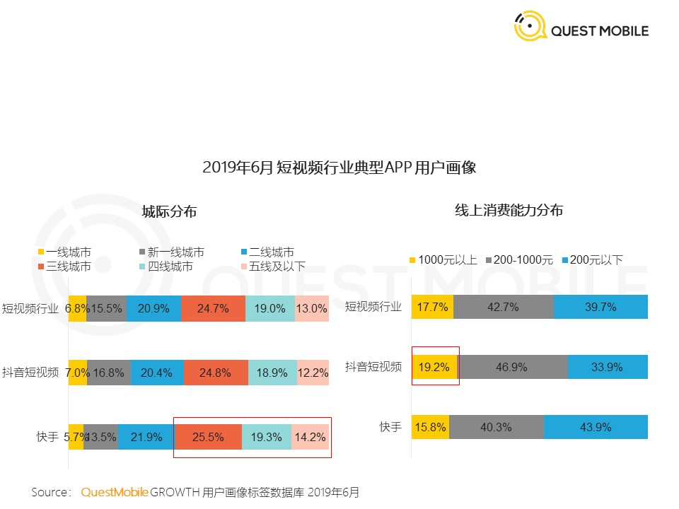
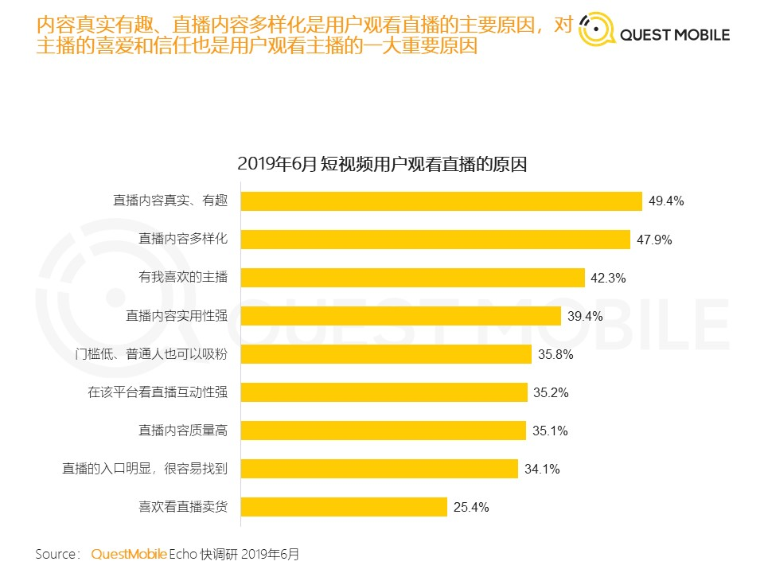
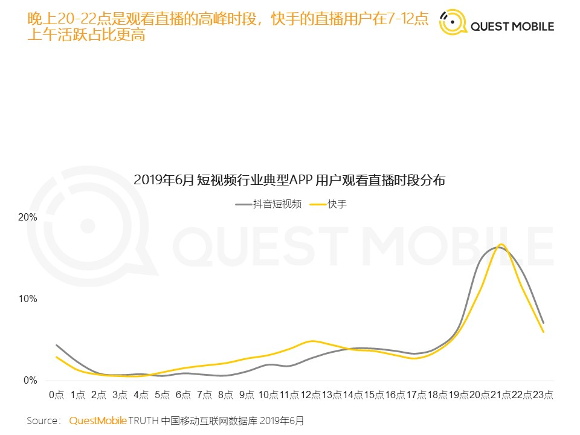
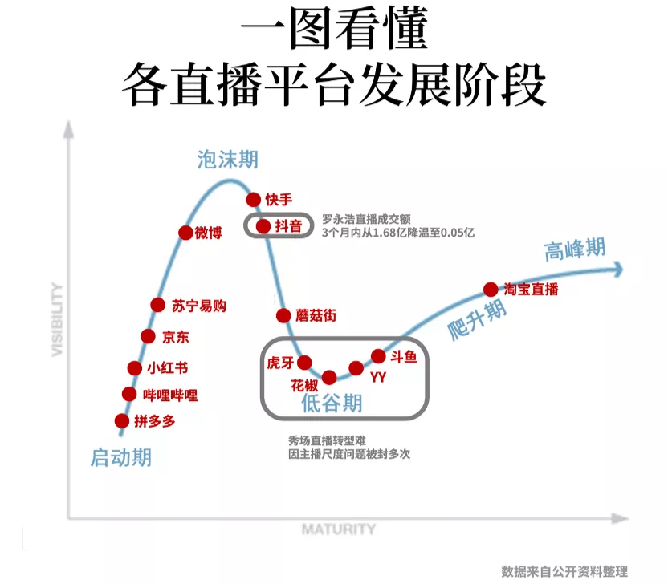

---

---

# 行业观察

## 移动短视频-202007

### 1. QuestMobile 短视频2019半年报告-201906

[原文链接]:https://www.questmobile.com.cn/research/report-new/58

**用户规模**

短视频行业6月份，新安装用户接近1亿，MAU 8.21亿，占互联网用户总量72%，同比增速32%，在线视频总体 MAU 9.64亿，同比增速2.4%，二者差距正在持续缩小。

**用户画像**

快手更下沉，抖音消费能力更强

新增用户主要来自35岁以上、三四线城市下沉用户

“记录生活、展现自己”是用户拍摄的主要动机，女性展示欲望比男性更强，用户占比高。

抖音/快手的用户中，有50%每天都会打开APP，七日留存率84.4% 、81.7%

**行业竞争**

人均打开短视频类APP 1.75个，同比增11%，行业竞争加剧，窗口收窄，流量争夺，用户独占率普遍下降。抖音快手重合用户规模翻翻达到1.6亿

月人均使用时长22小时，同比增8.6%，在不断侵蚀其他泛娱乐行业的时长。

玩家布局全景生态找流量，APP+小程序矩阵打法，快手APP月活34000w+,小程序月活2000w+。

用户规模同比上涨的APP占比降低，中长尾平台生存困难

野蛮生长期过渡到合规发展阶段，将迎来加速整合期。

两超多强格局形成，字节（抖音+西瓜+火山）、快手、腾讯（微视+火锅）、百度（好看+全民）。

[2020年7月注]:腾讯、百度自研视频产品已掉队，腾讯押注B站

抖音快手加大内容引入（生产者、游戏、PK、同城活动等），用户的娱乐、社交、购物需求都被覆盖。

**变现途径**

游戏；电商带货；广告；直播打赏；知识付费

抖音主信息流广告，快手主直播打赏和小游戏

## 广告行业

#### QuestMobile 2020中国互联网广告大报告（上篇）

[原文链接]:https://www.questmobile.com.cn/research/report-new/92

摘要：

## 直播

#### 1. 直播带货

[^直播带货泡沫有多大？]:https://mp.weixin.qq.com/s/dO2kMHo_OFANNmONbX0PhA

个人理解：

直播带货是电视时代的电视销售的升级，他们的本质都是导购。

只要有大量商品存在，消费者面临的永恒问题就是，【如何从海量的商品中高效找到少量适合的商品】，【适合】这个词又有更复杂的维度，外观、质量、安全性、使用寿命、性价比等等。

线下导购承担了【根据消费者需求匹配适合商品】工作，并从中赚取服务费用（提成）。

线上零售通过更丰富产品信息（图文、视频）、业绩数据展示（销量、收藏）、多维度排序、个性化推荐算法，很大程度上解决了消费者的决策困难，但只要仍然有海量的商品信息存在，这个问题就不会消失，甚至由于选择太多，诞生新的问题【这些看起来都不错】

结合《思考，快与慢》中的观点，人的购物决策模型：

慢思考：确认自身需求、了解大量商品信息并分辨真假好坏、

快思考：公众人物说这个好，而且有优惠券， 买就完了。

[^罗永浩带货量暴跌97%，直播电商怎么就不行了？]:https://mp.weixin.qq.com/s/l8tZhWbNncH7yJqX8U1BFg

核心观点：

1.  

流量平台的本质与直播电商的底层逻辑始终难以契合有关系

流量平台的流量来自哪里？无外乎内容、资讯、短视频。**流量平台需要在用户注意力和容忍度之间寻求商业化的平衡。**这就类似在用户逛游乐园的路上摆个小摊、设个广告牌。但用户来到抖音、快手的目的终究是为了“逛游乐园”、看短视频，而不是购物。

流量平台入局直播电商，其实并没有真的做电商的意思，更多还是“在游乐园门口多设广告牌”，或者加几个“直播带货摊位“。本质仍然是品牌广告的逻辑。

2014年开始，直播进入最火热的阶段，当时秀场直播、游戏直播是两个主要的模式。**秀场直播因为吸睛和打赏的优势，瞬间成为各家必争，但这个潮水来得快去得也快，没有稳定的产业依托，流量成为空中楼阁。**在YY、映客、花椒之后，抖音和快手也曾把重心放到过秀场类直播，但这类赚快钱的直播模式，最终被验证走不通。

**而在2016年淘宝直播捣鼓出来的直播电商，其实跟原先的直播没有什么关系。这类直播的核心在于卖货，这也就是为什么我们现在将其称之为直播电商，归在电商这一范畴的原因。**以淘宝直播为代表的直播电商是依托电商平台起来的，已经有四年的发展过程，包括薇娅和李佳琦在内的电商主播，他们的带货曲线是从几万、几十万这样的数据不断攀升上来的。本质上，来做直播电商的并非简单的广告，而是开启一场创业，培养一个个人品牌。

由此可以理解，抖音快手做的直播，跟直播电商还不是一种直播。前者是广告，而后者是商业。**在流量型平台，用户在一个内容作品上的消费特征是低停留，快速切换，本质还是广告的逻辑。**流量平台的产品本身是为了广告导流设计的，其与电商有本质的区别和冲突。这也就是为什么，关于流量平台的直播带货，转化率太低的吐槽层出不穷。

**一方面，直播电商需要完善的商业基础设施来支撑**，这一点，抖音和快手显然做得不够，比如客服问题，如果是用这些平台自建的“小店”的话，主播要自己去做客服。因此很多头部主播，宁可导向淘宝天猫店，也不愿意导向“小店”。比如罗永浩、辛巴等抖音、快手的主播，直播至今大部分的GMV还是在淘宝天猫上产生的。

像很多商家往往会通过达人直播，获取大量新客和粉丝，然后这些新客和粉丝进入到店铺之后，商家再通过自播来运营这些粉丝。因此在淘宝直播中，商家自播的GMV占到了70%。这才是直播电商真正的商业价值所在。

商家自播的成立才有可能形成私域流量运营的良性循环。而在抖音快手上，仅仅依靠纯流量分发的逻辑，以罗永浩、陈赫来树立标杆的逻辑，并不适合商家的长期利益。

**这意味着从本质逻辑上来看，直播电商未来的发展一定不会独立成为一个行业，而是作为电商消费者运营的一部分。因此，流量平台上只注重变现的直播火爆，是与这个趋势相违背的，也是这类直播快速降温的本质原因。**