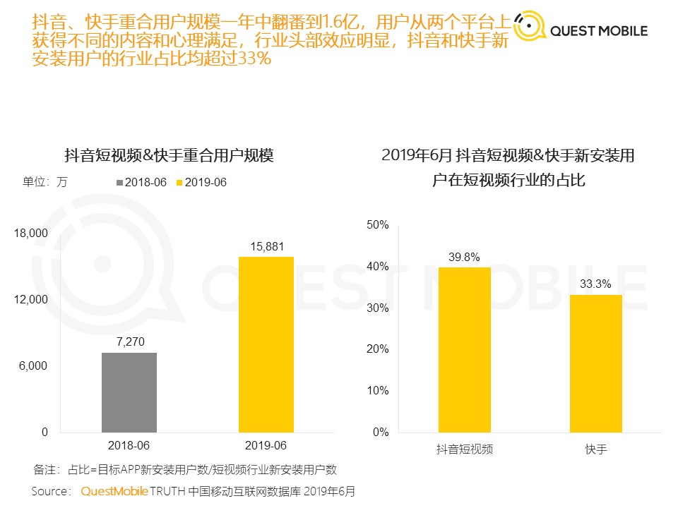

---

---

# 行业观察

## 移动短视频

### QuestMobile 短视频2019半年报告-201906

[原文链接]:https://www.questmobile.com.cn/research/report-new/58

#### 摘要

#### 1. 用户规模

短视频行业6月份，新安装用户接近1亿，MAU 8.21亿，占互联网用户总量72%，同比增速32%，在线视频总体 MAU 9.64亿，同比增速2.4%，二者差距正在持续缩小。

新增用户主要来自35岁以上、三四线城市下沉用户

#### 2. 行业竞争

人均打开短视频类APP 1.75个，同比增11%，行业竞争加剧，窗口收窄，流量争夺，用户独占率普遍下降。抖音快手重合用户规模翻翻达到1.6亿

玩家布局全景生态找流量，APP+小程序矩阵打法，快手APP月活34000w+,小程序月活2000w+。

用户规模同比上涨的APP占比降低，中长尾平台生存困难

野蛮生长期过渡到合规发展阶段，将迎来加速整合期。

两超多强格局形成，字节（抖音+西瓜+火山）、快手、腾讯（微视+火锅）、百度（好看+全民）。

[2020年7月注]:腾讯百度自研视频产品已掉队，腾讯押注B站

#### 3. 用户使用深度

月人均使用时长22小时，同比增8.6%，在不断侵蚀其他泛娱乐行业的时长。

抖音快手加大内容引入（生产者、游戏、PK、同城活动等），用户的娱乐、社交、购物需求都被覆盖。

抖音/快手的用户中，有50%每天都会打开APP，七日留存率84.4% 、81.7%

#### 4. 变现途径

游戏

电商带货

广告

直播打赏

知识付费

## 广告行业

#### QuestMobile 2020中国互联网广告大报告（上篇）

[原文链接]:https://www.questmobile.com.cn/research/report-new/92

摘要：

## 直播

#### 1. 直播带货

[直播带货泡沫有多大？]:https://mp.weixin.qq.com/s/dO2kMHo_OFANNmONbX0PhA

个人理解：

直播带货是电视时代的电视销售的升级，他们的本质都是导购。

只要有大量商品存在，消费者面临的永恒问题就是，【如何从海量的商品中高效找到少量适合的商品】，【适合】这个词又有更复杂的维度，外观、质量、安全性、使用寿命、性价比等等。

线下导购承担了【根据消费者需求匹配适合商品】工作，并从中赚取服务费用（提成）。

线上零售通过更丰富产品信息（图文、视频）、业绩数据展示（销量、收藏）、多维度排序、个性化推荐算法，很大程度上解决了消费者的决策困难，但只要仍然有海量的商品信息存在，这个问题就不会消失，甚至由于选择太多，诞生新的问题【这些看起来都不错】

结合《思考，快与慢》中的观点，人的购物决策模型：

慢思考：确认自身需求、了解大量商品信息并分辨真假好坏、

快思考：公众人物说这个好，而且有优惠券， 买就完了。

